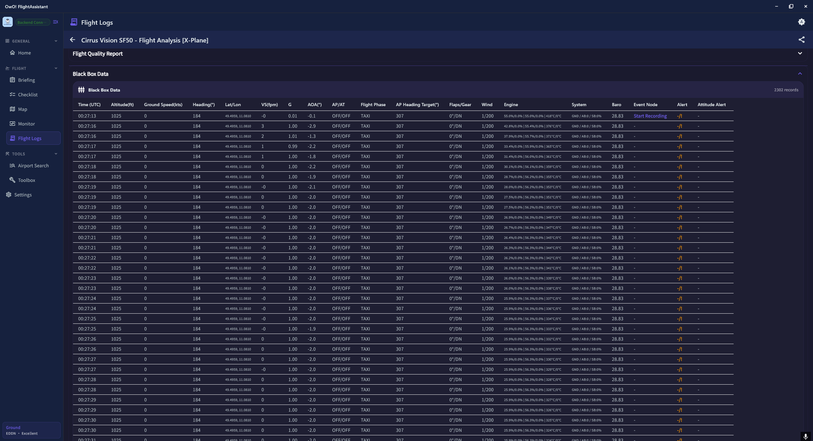
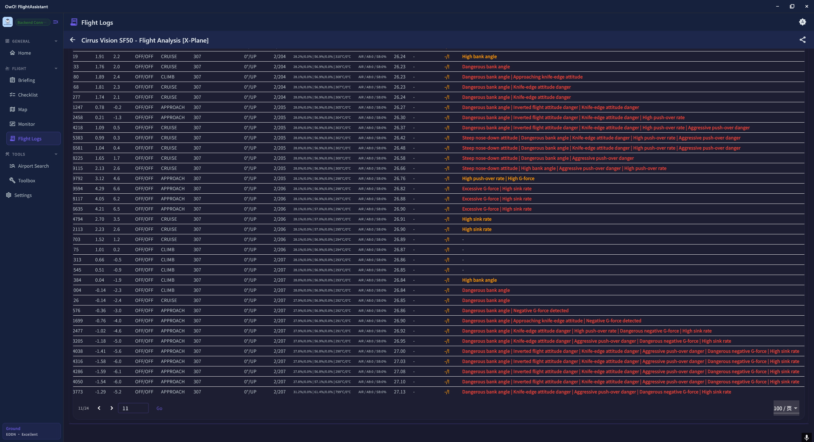

# OwO! FlightAssistant

[English](README.md)


OwO! FlightAssistant 是一个面向模拟飞行场景的模块化前端应用。
当前版本集成了飞行监控、检查单执行、地图可视化、机场与 METAR 查询、飞行日志分析，以及 MSFS / X-Plane 中间件连通诊断能力。

## 功能介绍

### 1) 首页总览与模拟器会话

| 基础信息 | 飞机信息 | 机场信息 |
| --- | --- | --- |
|  |  |  |

- 在首页完成模拟器连接/断开与会话状态管理。
- 聚合关键飞行参数与地面状态信息。
- 在一个页面内同时展示航班与机场上下文。

### 2) 机场搜索与飞行简报

| 机场搜索 | 简报生成 | 简报详情 |
| --- | --- | --- |
|  |  |  |

- 基于 ICAO 的机场搜索、联想建议与收藏管理。
- 通过中间件接口同时拉取机场详情与 METAR。
- 提供简报生成、展示与历史记录能力。

### 3) 检查单、监控与工具箱

| 检查单 | 监控图表 | 起落架监控 | 工具箱 |
| --- | --- | --- | --- |
|  |  |  |  |

- 执行多阶段 SOP 检查单（A320 / B737 / 通用机型）。
- 实时查看飞行监控组件（图表、航向、系统、起落架）。
- 在工具箱中使用飞行辅助工具与术语参考。

### 4) 地图模块（图层、天气、机场）

| 图层面板 | 机场类型 | 机场信息 | 天气雷达 |
| --- | --- | --- | --- |
|  |  |  |  |

- 支持多地图底图来源（OpenStreetMap、Esri、Carto）。
- 按机场类别渲染并展示机场详情卡片。
- 集成 RainViewer 雷达图层与时间帧能力。

### 5) 飞行日志与复盘分析

| 日志列表 | 航迹视图 | 飞行质量报告 | 风险测试 |
| --- | --- | --- | --- |
|  |  |  |  |

| 黑匣子数据 | 黑匣子风险告警 |
| --- | --- |
|  |  |

- 记录并回放飞行会话，支持轨迹与事件分析。
- 生成飞行质量评估与风险测试结果。
- 通过黑匣子视图进行飞后复盘。

### 6) 设置与中间件诊断

| 中间件设置 | 地图模块设置 | 全局设置 |
| --- | --- | --- |
|  |  |  |

- 配置 HTTP / WebSocket 中间件地址。
- 内置后端连通性与模拟器状态诊断。
- 支持地图与应用级参数个性化设置。

## 适用设备与模拟器

### 响应式布局区间

- **手机布局**：宽度 `< 650`
- **平板布局**：宽度 `650 - 1241`
- **桌面布局**：宽度 `>= 1242`

### 仓库目标平台

- **Windows 桌面端**：推荐主力运行环境
- **Android / iOS**：移动端伴飞场景可用
- **Web**：具备基础 Web 目标工程

### 模拟器支持

- **Microsoft Flight Simulator（2020 / 2024）**
- **X-Plane（11 / 12）**

## 前端架构概览

```text
lib/
├── core/                    # 应用壳层、国际化、主题、模块注册
├── modules/
│   ├── home/                # 首页与模拟器连接控制
│   ├── checklist/           # SOP 检查单
│   ├── map/                 # 交互地图、图层、天气
│   ├── airport_search/      # ICAO 搜索、机场详情、METAR
│   ├── monitor/             # 实时监控与图表
│   ├── briefing/            # 飞行简报生成与历史
│   ├── flight_logs/         # 飞行日志与分析
│   ├── toolbox/             # 工具箱
│   └── http/                # 中间件配置与诊断
└── main.dart
```

模块统一注册入口：`lib/modules/modules_register_entry.dart`。

## 安装与使用方法

### 环境要求

- Flutter SDK `^3.9.2`
- 可运行的中间件后端实例（默认：`http://127.0.0.1:18080`）
- 可选模拟器运行环境：
  - MSFS 2020/2024
  - X-Plane 11/12

### 安装步骤

```bash
git clone <your-fork-or-repo-url>
cd owo_flight_assistant
flutter pub get
```

### 启动方式（推荐 Windows）

```bash
flutter run -d windows
```

其他目标：

```bash
flutter run -d android
flutter run -d ios
flutter run -d chrome
```

### 基本使用流程

1. 进入 **Settings → Middleware Settings**，确认后端地址。
2. 回到 **Home** 页面，建立模拟器连接。
3. 飞行中使用 **Checklist / Map / Monitor / Airport Search** 模块。
4. 飞行后在 **Flight Logs** 页面进行复盘分析。

## 使用到的开源仓库 / 库

核心框架与状态管理：

- [Flutter](https://flutter.dev/)
- [provider](https://pub.dev/packages/provider)

网络通信与模拟器通道：

- [http](https://pub.dev/packages/http)
- [web_socket_channel](https://pub.dev/packages/web_socket_channel)

地图与地理能力：

- [flutter_map](https://pub.dev/packages/flutter_map)
- [latlong2](https://pub.dev/packages/latlong2)

存储、文件与桌面能力：

- [shared_preferences](https://pub.dev/packages/shared_preferences)
- [sqlite3](https://pub.dev/packages/sqlite3)
- [sqlite3_flutter_libs](https://pub.dev/packages/sqlite3_flutter_libs)
- [file_picker](https://pub.dev/packages/file_picker)
- [window_manager](https://pub.dev/packages/window_manager)

UI 与工具能力：

- [fl_chart](https://pub.dev/packages/fl_chart)
- [flex_color_picker](https://pub.dev/packages/flex_color_picker)
- [google_fonts](https://pub.dev/packages/google_fonts)
- [flutter_local_notifications](https://pub.dev/packages/flutter_local_notifications)
- [share_plus](https://pub.dev/packages/share_plus)
- [url_launcher](https://pub.dev/packages/url_launcher)
- [logger](https://pub.dev/packages/logger)
- [intl](https://pub.dev/packages/intl)
- [confetti](https://pub.dev/packages/confetti)

## API 接口清单（前端调用）

默认中间件地址：

- HTTP Base URL：`http://127.0.0.1:18080`
- WebSocket Base URL：`ws://127.0.0.1:18081/api/v1/simulator/ws`

主要接口：

- `GET /health`
- `GET /api/v1/version`
- `GET /api/v1/airport/{icao}`
- `GET /api/v1/airport-layout/{icao}`
- `GET /api/v1/metar/{icao}`
- `GET /api/v1/airport-list`
- `GET /api/v1/airport-suggest?q={query}&limit={n}`
- `GET /api/v1/airports?min_lat=&max_lat=&min_lon=&max_lon=&limit=`
- `POST /api/v1/simulator/state`
- `POST /api/v1/simulator/connect`
- `POST /api/v1/simulator/data`
- `POST /api/v1/simulator/disconnect`
- `GET /api/v1/simulator/ws`

地图/气象第三方服务：

- [OpenStreetMap Tile](https://tile.openstreetmap.org/)
- [Esri World Imagery](https://server.arcgisonline.com/ArcGIS/rest/services/World_Imagery/MapServer)
- [Esri World Topo](https://server.arcgisonline.com/ArcGIS/rest/services/World_Topo_Map/MapServer)
- [Carto Basemaps](https://carto.com/basemaps)
- [RainViewer Weather Maps](https://www.rainviewer.com/api.html)

## 开源许可

本项目采用以下许可证：

- **Creative Commons Attribution-NonCommercial-ShareAlike 4.0 International**
- 完整条款见 [LICENSE](LICENSE)。

## 开发者信息

- 团队：**OwOTeam-DGMT (OwOBlog)**
- 主要开发者：**HanskiJay**
- 联系邮箱：**<support@owoblog.com>**
- GitHub： [Tommy131](https://github.com/Tommy131)
- 仓库： [OwO-FlightAssistant](https://github.com/Tommy131/OwO-FlightAssistant)
- Telegram： [@HanskiJay](https://t.me/HanskiJay)

## 免责声明

本项目仅用于模拟飞行训练、学习与研究。
请勿用于真实飞行操作。
