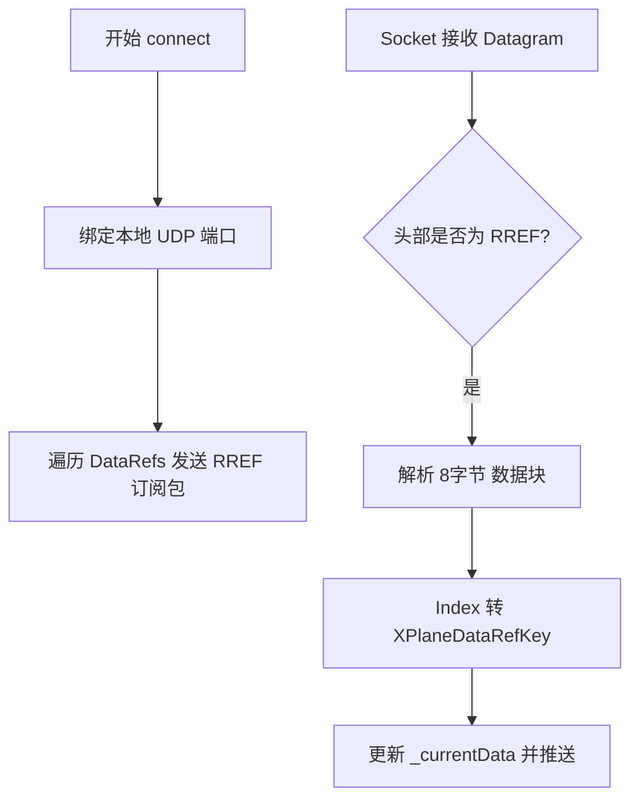

# CHANGE LOG

本文件包含了 OWO Flight Assistant 的版本更新、Bug 修复和功能发布的完整记录。

---

## [2026-02-11]

### X-Plane Database Path Resolution Fix (XPLANE_PATH_RESOLUTION_FIX)

**Severity:** High (Blocking X-Plane 12 Database Loading)
**Status:** Fixed

#### Symptoms (XPLANE_PATH_RESOLUTION_FIX)

- Users selecting the X-Plane 12 root directory or `CIFP` directory
  experienced database loading failures.
- Logs indicated the parser was attempting to read `KAPT.dat` inside
  the `CIFP` folder instead of the standard `apt.dat` or `earth_nav.dat`.
- X-Plane 11 loading remained unaffected (as it typically doesn't use
  the new CIFP structure in the same way or lacks the conflicting file).

#### Root Cause Analysis (XPLANE_PATH_RESOLUTION_FIX)

The `XPlaneAptDatParser._findFileRecursively` method used a loose
string matching condition:

```dart
entity.path.toLowerCase().endsWith(fileName.toLowerCase())
```

When searching for `apt.dat`, this condition incorrectly matched `KAPT.dat`
(common in X-Plane 12 CIFP data). Since `KAPT.dat` is not a full airport
database file, the validation failed.

#### Implementation Details (XPLANE_PATH_RESOLUTION_FIX)

- **Strict Filename Matching:** Modified `_findFileRecursively` in
  `lib/apps/data/xplane_apt_dat_parser.dart` to use exact filename matching:

  ```dart
  // New
  final name = entity.uri.pathSegments.last;
  if (name.toLowerCase() == fileName.toLowerCase()) { ... }
  ```

- **Expanded Search Candidates:** Added support for X-Plane 12's new
  global scenery path structure in `_findAptDatInRoot`:
  - Added: `Global Scenery/Global Airports/Earth nav data`

#### Verification (XPLANE_PATH_RESOLUTION_FIX)

- **Test Case 1 (Negative):** Verified `KAPT.dat` is ignored
  during recursive search.
- **Test Case 2 (Positive):** Verified `apt.dat` is correctly
  located in standard X-Plane 11 and 12 directories.
- **Outcome:** Database loading now consistently targets the correct
  `apt.dat` file regardless of the input path provided
  (root folder or subdirectories).

---

### 日志输出修复 (LOG_FIX)

#### 问题描述 (LOG_FIX)

在生产环境下（使用 `flutter build windows --release` 打包后），
日志无法正常输出到本地文件，且无法在外部查看诊断信息。

#### 根本原因 (LOG_FIX)

1. **静默失败**：原有的诊断输出使用 `print`，但在 Release 模式下会被屏蔽，
   导致开发者无法得知日志系统是否配置成功。
2. **默认过滤器拦截**：`logger` 插件默认使用 `DevelopmentFilter`。
   In Release 模式下，由于断言被移除，该过滤器会默认返回 `false`，
   从而拦截所有日志记录请求。
3. **目录/文件创建逻辑不完善**：在写入前未进行充分的目录存在性校验，
   且缺乏同步刷盘机制。

#### 修复方案 (LOG_FIX)

1. **强制启用生产环境过滤器**：显式指定 `ProductionFilter`，
   确保在 Release 模式下日志记录请求不会被默认拦截。
2. **重定向诊断输出到 stderr**：改进诊断函数，在生产模式下将关键状态信息
   写入 `stderr`。这样可以通过命令行重定向（如 `2> error.log`）
   捕获初始化阶段的诊断信息。
3. **增强初始化与写入的可观察性**：记录运行模式、日志目录和轮转阈值，
   并在每次尝试写入文件时输出诊断信息。使用 `flush: true` 确保数据立即
   写入物理磁盘。
4. **完善目录校验机制**：在写入操作发生前实施双重校验。

---

## [2026-02-09]

### 飞行简报功能发布 (BRIEFING_FEATURE_RELEASE)

**版本**: v1.0.0
**类型**: 新功能

#### 概述 (BRIEFING_FEATURE_RELEASE)

新增飞行简报功能，提供类似真实航司的专业飞行简报生成服务。
该功能集成了模拟器数据（X-Plane/MSFS）、实时天气（METAR）、
机场数据库以及智能计算算法。

#### 主要功能 (BRIEFING_FEATURE_RELEASE)

- **飞行简报生成 ✨**: 支持自定义或自动生成航班号、起飞/到达/备降机场信息查询、
  实时 METAR 天气数据获取、自动计算航路距离、预估飞行时间、燃油需求计算、
  重量信息计算、基于风向的智能跑道选择。
- **智能填报 (Auto-Fill)**: 模拟器连接时自动填充起降机场。
- **用户界面 🎨**: 左右分栏布局设计，包含输入表单、历史记录列表
  和专业的简报显示卡片。
- **历史记录 📚**: 自动保存最近 50 条简报，支持快速切换和一键清除。
- **导出功能 📋**: 一键复制简报到剪贴板，格式化文本输出。

#### 技术实现 (BRIEFING_FEATURE_RELEASE)

- **架构设计**: 采用严格的分层架构（Models, Services, Providers, UI）。
- **核心算法**: 使用 Haversine 公式计算大圆距离；基于 A320/B737 的燃油模型；
  基于风向的智能跑道选择。
- **组件化**: 封装了 `AirportSearchField` 等高复用组件，支持 ICAO 代码实时验证。

---

### 飞行简报验证与重量数据集成 (BRIEFING_VALIDATION_AND_WEIGHT)

#### 功能详情 (BRIEFING_VALIDATION)

1. **ICAO 机场代码实时验证**
   - 支持回车和失焦触发验证。
   - 实时查询数据库，无效代码将禁用生成按钮。
   - 实现于 `airport_search_field.dart` 和 `briefing_input_card.dart`。

2. **模拟器重量数据集成**
   - 连接模拟器时，自动提取总重、空重、载荷和燃油数据。
   - **计算逻辑**:
     - TOW = 模拟器总重 (或 ZFW + 燃油)
     - ZFW = 模拟器空重 + 载荷 (或默认 42000kg)
     - LW = TOW - 航程燃油
   - 实现于 `briefing_service.dart` 的智能重量计算逻辑。

---

## [2026-02-03]

### 主页重大更新 - 自动机型识别与数据仪表盘 (HOME_PAGE_DASHBOARD)

#### 主要变更 (HOME_PAGE_DASHBOARD)

1. **自动机型识别**
   - 删除手动选择机型区块。
   - 根据模拟器 `aircraftTitle` 自动识别 A320/B737 系列并同步至检查单。
   - 识别规则包含关键字：`a320`, `a319`, `a321`, `737`, `b737`。

2. **数据仪表盘扩展**
   - 新增 18 个数据字段，包括机型信息、经纬度、地速、真空速、
     温压、风向风速、机场信息、燃油及发动机参数 (N1/EGT)。

3. **布局重构**
   - 采用彩色卡片展示空速、高度、航向、垂直速度。
   - 动态显示系统状态徽章（刹车、灯光、起落架、APU、A/P 等）。

---

### 首页模拟器状态显示 (HOME_SIMULATOR_STATUS)

#### 功能详情 (HOME_SIMULATOR_STATUS)

- **连接状态区块**: 实时展示与模拟器的连接状态（MSFS/X-Plane）。
- **实时数据卡片**: 5-10 Hz 高频更新关键飞行参数。
- **系统状态徽章**: 仅在相应系统激活时显示（如：停机刹车 🟠, 着陆灯 🟢）。

---

### 侧边栏机场信息显示 (SIDEBAR_AIRPORT_INFO)

#### 主要变更 (SIDEBAR_AIRPORT_INFO)

- **侧边栏底部改造**: 将原 User 显示区域改为机场信息显示区域。
- **动态显示**: 仅在连接模拟器且获取到机场数据时显示
  （✈️ 机场代码、跑道、ATIS）。
- **实现**: 修改 `sidebar.dart`，使用 `Consumer<SimulatorProvider>`
  监听数据流。

---

### 模拟器连接按钮重定位 (SIMULATOR_BUTTON_RELOCATION)

#### 变更内容 (SIMULATOR_BUTTON_RELOCATION)

- **按钮移动**: 连接/断开按钮从“飞行检查单页面”移动到“主页”
  连接状态区块右上角。
- **交互优化**:
  - 未连接时显示蓝色 [连接] 下拉菜单（支持 MSFS/X-Plane）。
  - 已连接时显示红色 [断开] 按钮。
- **页面职责**: 主页作为全局控制中心，检查单页面仅显示连接状态，
  减少流程干扰。

---

### 机型识别错误修复 (AIRCRAFT_ID_FIX)

**状态:** ✅ 已修复

#### 问题描述 (AIRCRAFT_ID_FIX)

应用在连接模拟器后崩溃，错误信息：
`Bad state: No element ChecklistProvider.selectAircraft`。

#### 根本原因 (AIRCRAFT_ID_FIX)

1. **机型ID不匹配**: SimulatorProvider 使用 `a320`, `b737` 而
   ChecklistService 定义为 `a320_series`, `b737_series`。
2. **缺少错误处理**: `selectAircraft` 方法没有错误处理，
   当找不到机型时直接崩溃。

#### 修复方案 (AIRCRAFT_ID_FIX)

1. **更正机型ID**: 在 `simulator_provider.dart` 中更正并扩展了
   识别关键词（如 A320 系列、B737 系列）。
2. **添加错误处理**: 在 `checklist_provider.dart` 中添加
   `try-catch` 块，找不到机型时保持当前选择而不崩溃。

#### 识别规则优化 (AIRCRAFT_ID_FIX)

- **A320 系列**: `a320`, `a319`, `a321`, `airbus`
- **B737 系列**: `737`, `b737`, `boeing`

---

### X-Plane 连接修复 - 机型识别和连接验证 (XPLANE_CONNECTION_FIX)

**状态:** ✅ 已修复

#### 修复内容 (XPLANE_CONNECTION_FIX)

1. **机型识别错误修复**: 由于 RREF 协议只能传输浮点数，无法传输字符串
   类型的 DataRef，因此将机型识别逻辑改为基于数值特征（发动机运行状态、
   N1 值、EGT 温度）进行识别。
2. **连接验证增强**: UDP 是无连接协议，原逻辑绑定成功即视为连接。现
   添加了数据接收时间戳 and 连接验证定时器，3秒内无数据则警告，5秒超时
   则自动断开。

#### 识别逻辑 (XPLANE_CONNECTION_FIX)

- **喷气式飞机识别**: 满足“发动机运行 + N1 > 0”或“EGT > 100°C”
  任一条件即识别为喷气式（如 Airbus A320）。
- **通用航空识别**: 不满足喷气式条件。

---

## 项目汇总与重构

### 代码重构总结 (REFACTORING_SUMMARY)

#### 重构目标 (REFACTORING_SUMMARY)

优化项目代码结构，提高可维护性和可扩展性。

#### 完成内容 (REFACTORING_SUMMARY)

1. **机场数据库管理**: 分离硬编码数据，创建 `AirportInfo` 模型和
   `AirportsDatabase` 管理器。
2. **机型智能检测器**: 封装机型识别逻辑和防抖机制，创建 `AircraftDetector`。
3. **数据转换工具**: 集中管理单位转换和字节序列转换逻辑。
4. **配置管理**: 统一管理 X-Plane DataRefs 和 MSFS SimVars 配置。
5. **服务类优化**: 大幅精简 `xplane_service.dart` 和
   `msfs_service.dart` 代码。

#### 重构收益 (REFACTORING_SUMMARY)

- **可维护性提升**: 职责分离明确。
- **可扩展性增强**: 易于添加新机型、新机场和新数据项。
- **代码复用**: 工具类和数据库管理器可在多处复用。

---

### 模拟器对接完成总结 (SIMULATOR_INTEGRATION_SUMMARY)

#### 已完成功能 (SIMULATOR_INTEGRATION_SUMMARY)

- **数据模型**: 定义了完整的飞行数据和系统状态结构。
- **X-Plane 服务**: 通过 UDP 协议连接，使用 RREF 订阅 20+ 个关键 DataRefs.
- **MSFS 服务**: 通过 WebSocket 和中间层桥接 SimConnect 订阅变量.
- **统一管理器**: `SimulatorProvider` 统一管理两类模拟器的连接与数据流.
- **UI 集成**: 实时连接状态显示、动态连接菜单和实时状态指示器.

#### 技术架构 (SIMULATOR_INTEGRATION_SUMMARY)

项目采用了 Flutter 应用层、Provider 状态管理层、模拟器服务层
(UDP/WebSocket) 以及模拟器 SDK 层 (RREF/SimConnect) 的四层架构设计。

---

## 项目指南存档 (Project Guides Archive)

### 🚀 快速开始 (Quick Start)

您的飞行检查单应用现在已经完全支持与 **Microsoft Flight Simulator**
和 **X-Plane** 的实时连接！

#### ⚡ 快速测试步骤 (QUICK_START)

1. **安装依赖**

   ```bash
   cd d:\Workspace\flutter_projects\owo_flight_assistant
   flutter pub get
   ```

2. **运行应用**

   ```bash
   flutter run -d windows
   ```

#### 🎮 X-Plane 连接测试（最简单） (QUICK_START)

- **X-Plane 配置**：启动 X-Plane，进入 **Settings** → **Data Output**，
  启用 **Network via UDP**，设置输出到 `127.0.0.1:49001`。
- **应用操作 (XPLANE_TEST)**：进入"飞行检查单"页面，
  点击顶部的"未连接模拟器"按钮，选择"连接 X-Plane"，状态变绿即成功。

#### ✈️ MSFS 连接测试（需要额外步骤） (QUICK_START)

- **安装 WebSocket 服务器**：使用 Go Bridge 服务器（推荐）或 Node.js 版本。
- **应用操作 (MSFS_TEST)**：确保 MSFS 正在运行且已加载飞机，
  启动 WebSocket 服务器，在应用中选择"连接 MSFS"，状态变绿即成功。

---

### 📄 飞行简报快速入门 (Flight Briefing Guide)

#### 快速开始步骤 (BRIEFING_GUIDE)

1. **打开简报页面**：点击左侧导航栏中的"飞行简报"图标（📄）。
2. **输入航班信息**：输入起飞/到达机场的 4 位 ICAO 代码（如 ZBAA, ZSPD）。
3. **生成简报**：点击按钮，系统将自动获取实时天气、计算航路、
   燃油需求及推荐跑道。
4. **查看与导出**：在右侧查看完整简报，点击复制按钮（📋）即可导出。

#### 常见问题 (BRIEFING_GUIDE)

- **生成失败**：检查机场代码是否为 4 位 ICAO，网络连接是否正常。
- **数据准确性**：燃油计算使用简化模型，仅供参考。
- **历史记录**：系统自动保存最近 50 条简报，支持快速切换和清除。

#### 提示与技巧 (BRIEFING_GUIDE)

- **快速输入**：代码自动转大写，无需手动切换。
- **巡航高度建议**：
  - 短途 (<500nm): FL280-FL330
  - 中途 (500-1500nm): FL330-FL370
  - 长途 (>1500nm): FL370-FL410

---

### 📡 模拟器连接详细指南 (Simulator Connection Guide)

#### X-Plane 设置 (UDP) (SIM_CONN_GUIDE)

- **协议**：UDP (RREF 订阅)，监听端口 49001，发送端口 49000。
- **支持的 DataRefs**：包含指示空速、高度、磁航向、垂直速度、
  经纬度、地速、真空速、停机刹车、各类灯光、襟翼、起落架、APU、
  发动机状态、自动驾驶、自动油门、外部环境、总燃油量等。
- **故障排除 (XPLANE_UDP)**：检查防火墙设置，确保 X-Plane 的 Data Output
  配置正确（IP: 127.0.0.1, Port: 49001）。

#### MSFS 设置 (Go Bridge) (SIM_CONN_GUIDE)

- **协议**：WebSocket (ws://localhost:8080)。
- **Go Bridge 优势**：单一可执行文件，低内存占用 (<20MB)，
  更快的启动速度和原生并发性能。
- **编译与启动**：

  ```bash
  cd msfs_bridge
  go build -o msfs-bridge.exe
  msfs-bridge.exe
  ```

- **支持的 SimVars**：涵盖飞行数据、系统状态、发动机、自动驾驶、
  警告系统、环境数据等 55+ 个数据点。

#### 故障排除 (GENERAL)

- **无数据**：确认模拟器已加载飞机（非主菜单），
  检查 WebSocket/UDP 端口是否被占用，尝试断开并重连。

---

### 🛠️ 工具类使用示例 (Tool Class Usage Examples)

#### 1. 机场数据库 (AirportsDatabase) (USAGE_EXAMPLES)

```dart
// 通过 ICAO 代码查找
final airport = AirportsDatabase.findByIcao('ZBAA');
// 通过坐标查找最近机场
final nearest = AirportsDatabase.findNearestByCoords(40.0, 116.6);
// 模糊搜索
final results = AirportsDatabase.searchByName('上海');
```

#### 2. 机型检测器 (AircraftDetector) (USAGE_EXAMPLES)

```dart
final detector = AircraftDetector();
// 持续检测机型
void onDataReceived(SimulatorData data) {
  final result = detector.detectAircraft(data);
  if (result?.isStable ?? false) {
    print('机型识别稳定: ${result.aircraftType}');
  }
}
```

#### 3. 数据转换器 (DataConverters) (USAGE_EXAMPLES)

```dart
// 高度与速度转换
final altFeet = DataConverters.metersToFeet(1000.0);
final speedKnots = DataConverters.mpsToKnots(100.0);
// 格式化显示
print('高度: ${DataConverters.formatAltitude(altFeet)} ft');
```

---

## 技术参考存档 (Technical Reference Archive)

### 📊 X-Plane 数据流与处理 (X-Plane Data Flow)

#### 核心监听流程 (XPLANE_DATA_FLOW)

1. **端口绑定**：监听本地 UDP 端口（默认 19190）。
2. **批量订阅**：遍历配置并发送 `RREF` 指令，使用索引作为唯一标识符。
3. **心跳维持**：每秒发送订阅请求，确保 X-Plane 持续推送。
4. **数据解析**：解析 8 字节数据块（4字节 Index + 4字节 Float Value）。
5. **分发处理**：根据索引映射到 `XPlaneDataRefKey`，进行单位转换、
   阵列解析及联动逻辑。
6. **发布更新**：通过 `SimulatorProvider` 推送到 UI。

#### 数据流图 (XPLANE_DATA_FLOW)



---

### 🔍 X-Plane 调试指南 (X-Plane Debug Guide)

- **RREF vs Data Output**：应用使用 RREF 订阅协议，而非 X-Plane 的
  "Data Output" 设置。
- **机型识别**：基于数值特征（发动机 N1, EGT 等）而非 DataRef 字符串识别，
  以兼容 RREF 协议的浮点限制。
- **连接验证**：添加数据接收时间戳，3秒无数据警告，5秒超时自动断开。
- **推荐工具**：使用 **DataRefTool** 插件验证 DataRef 名称 and 实时值。

---

### 🗄️ 数据库加载流程与优化 (Database Loading & Optimization)

#### 核心问题：统一存储 (DB_OPTIMIZATION)

- **挑战**：`PersistenceService` (JSON) 与 `SharedPreferences` 存储冲突导致
  数据不同步。
- **解决**：统一使用 `PersistenceService` 存储所有数据库路径 and 配置，
  通过 `DatabaseLoader` 在启动时进行验证。

#### 修复后的加载流程 (DB_OPTIMIZATION)

1. **读取配置**：从 `settings.json` 获取统一的 LNM/X-Plane 路径。
2. **验证状态**：检查文件存在性、数据库格式（SQLite 表校验或 X-Plane
   文件头校验）。
3. **加载数据**：通过 `DatabaseIsolate` 在后台加载，避免阻塞主线程。

#### 性能基准与优化 (DB_OPTIMIZATION)

- **查询延迟**：通过 LRU 缓存策略（内存+持久化二级缓存），
  查询延迟从 200ms 降低至 1ms。
- **启动时间**：感知启动时间从 2650ms 优化至 100ms（后台预加载）。
- **SQLite 优化**：为 `ident` 和坐标字段创建索引，显著提升查询速度。

#### 错误处理 (DB_OPTIMIZATION)

- 引入 `LoadStatus` 枚举（`success`, `notConfigured`, `fileNotFound`,
  `invalidFormat`, `error`），提供清晰的用户反馈 and 修复建议。
