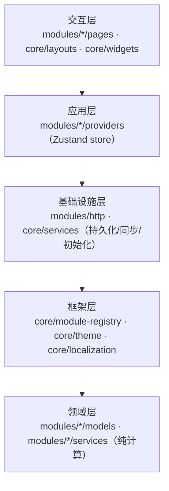

# OwO! FlightAssistant Web — 权威设计（DESIGN）

> 本文件是本项目的**唯一事实来源**（SSOT）。README 面向使用者，CLAUDE.md 面向贡献者，
> 两者只写差异点，通则一律引用本文件。
>
> 对标：ISO/IEC 25010（质量模型）、ISO/IEC/IEEE 29148（需求）、42010（架构描述）、
> IEEE 1016（详细设计）、29119（测试）、SemVer 2.0.0、Conventional Commits 1.0。

---

## 1. 定位与范围

把 [OwO! FlightAssistant](https://github.com/Tommy131/OwO-FlightAssistant) Flutter 桌面版
完整移植为浏览器应用，保留原版的**模块化微内核架构**、**设计语言**与**后端 API 契约**。

- **前端**（本仓库，公开）：React 19 + TypeScript + Vite + Zustand。
- **后端**（OwO-FlightAssistant-Middleware，**闭源**）：Go 中间件，负责模拟器对接、
  导航数据解析、天气/空域代理与持久化。以**编译产物**形式随 Release 分发。

### 1.1 采纳的工程理念

显式声明采纳下列理念，并在评审中逐条把关（见工程手册 §1）：

| 理念 | 本项目落地 |
|---|---|
| 声明式优先 | 11 张模块注册表；加功能=新增模块目录 + 注册一行 |
| 关注点分离 | `core/` 框架层对业务模块一无所知 |
| 依赖单向 | 见 §3.2 依赖方向铁律 |
| 模块化可插拔 | 删除任一 `modules/<name>/` + 去掉注册行，应用仍可编译运行 |
| 单一事实来源 | 版本号以 `package.json` 为准，CI 校验跨文件同步 |
| 缺失即可见 | i18n 缺键回退到 key 本身，让遗漏自曝 |
| 失败隔离 | 单个图层/数据源失败不影响其余；后台拉取失败不写缓存，下次重试 |

---

## 2. 需求（ISO/IEC/IEEE 29148）

### 2.1 功能性需求（FR）

| 编号 | 需求 | 实现位置 |
|---|---|---|
| FR-1 | 与中间件建立 HTTP + WebSocket 链路，实时接收模拟器遥测 | `modules/http/`、`modules/common/` |
| FR-2 | 地图显示本机、AI 机、航迹、机场与跑道/停机位/滑行道 | `modules/map/` |
| FR-3 | 气象叠加：雷达回波、降水、风、气压、温度，各带图例色标 | `modules/map/models/map-legends.ts` |
| FR-4 | 跑道进近设施展示：ILS 类别、航向台频率/航道、下滑角、DME | `modules/map/`（数据源 `earth_nav.dat`） |
| FR-5 | 进近波束与已公布等待航线的图形化显示 | `services/approach-beam.ts`、`services/holding-geometry.ts` |
| FR-6 | 连接模拟器时按标准 PAPI 逻辑给出目视坡度指示 | `services/papi-guidance.ts` |
| FR-7 | 检查单随遥测自动勾选，且可手动接管与交还 | `modules/checklist/` |
| FR-8 | 飞行简报生成，机场 ICAO 实时校验并联动跑道选择 | `modules/briefing/` |
| FR-9 | 飞行日志与简报的导入导出，并持久化到后端 | `core/services/backend-sync.ts` |
| FR-10 | 多语言（zh/en/de）运行时切换，无需重启 | `core/localization/` |
| FR-11 | 首次启动向导只执行一次，设置存于后端数据库 | `core/services/app-initialization-service.ts` |
| FR-12 | 刷新页面后停留在上次访问的页面 | `core/app.tsx` |

### 2.2 非功能性需求（NFR → ISO/IEC 25010）

| 编号 | 质量子特性 | 要求 |
|---|---|---|
| NFR-1 | 可维护性·模块性 | 单文件单职责，建议 ≤400 行；模块可独立裁剪 |
| NFR-2 | 可维护性·可分析性 | 关键节点分级日志；外部依赖失败必记 warning |
| NFR-3 | 性能效率 | 高频遥测下地图图层**增量更新**，不整层重建 |
| NFR-4 | 兼容性 | 后端 API 契约与桌面版一致，同一中间件同时服务两端 |
| NFR-5 | 可靠性·容错 | 任一外部数据源（瓦片/Overpass/Open-Meteo）失败均降级，不阻断其余功能 |
| NFR-6 | 安全性 | 后端返回的文本插入 DOM 前必须转义；凭据不入库 |
| NFR-7 | 易用性 | 缺数据时显式提示而非空白；危险操作二次确认 |
| NFR-8 | 可移植性 | 纯浏览器运行，无桌面专属依赖；构建产物为静态文件 |

---

## 3. 架构（ISO/IEC/IEEE 42010）

### 3.1 分层视图



### 3.2 依赖方向铁律（评审一票否决）

- 依赖**单向向内**。`modules/*/models` 与纯计算 `services/`（如 `geo`、`approach-beam`、
  `holding-geometry`、`papi-guidance`、`airport-outline`、`map-response-parsers`、
  `metar-decode`）**MUST NOT** 依赖 React、Leaflet、Zustand 或任何 IO ——
  它们必须能被单独调用与测试。
- `core/` **MUST NOT** import 任何 `modules/`。框架层对业务模块一无所知。
- 页面组件不直接发 HTTP；一律经 store → `MiddlewareHttpService`。
- **跨模块引用只允许指向共享模块**（`http` 传输层、`common` 遥测层、
  `airport_search/models`）与组合根 `modules-register-entry.ts`。业务模块之间不得
  互相 import 对方的 `providers/`（那是别人的内部状态），否则模块就不可独立裁剪了。
  `scripts/check-architecture.mjs` 守前两条，第三条目前靠评审。

### 3.3 模块注册表（微内核）

11 张注册表位于 `core/module-registry/`：导航、路由、设置页、Provider 绑定、
向导步骤、清理回调等。每个业务模块在 `modules/<name>/<name>-module.tsx` 里声明式注册。

> **注册表工厂可以调用 React hooks** —— 它们在 render 期间求值，等价于 Flutter 的
> `context.watch`。这是有意设计，不要改成 `getState()`。`initializeAll()` 之后禁止再注册，
> 因此 hooks 调用顺序稳定。

### 3.4 数据流

```
模拟器 → Go 中间件 →(WebSocket 遥测)→ flight-data-store →(订阅)→ 各模块 store → UI
                   →(HTTP 查询)→ 模块 store → UI
                   ←(设置/日志/简报持久化)← core/services/*
```

---

## 4. 关键设计决策

完整记录见 `docs/adr/`。摘要：

| 决策 | 理由 |
|---|---|
| 不用 Tauri/Electron，纯 Web 合理降级 | 保留全部业务功能；放弃无边框标题栏与本地路径选择向导 |
| 不引 MUI，手写组件复刻 Material 3 | 与桌面版设计语言逐像素对齐，避免第三方主题打架 |
| 开发期用 Vite 代理解决 CORS | 不改动中间件；生产由中间件同源托管静态产物 |
| 前端设置存后端数据库 | 换浏览器/清缓存后不再重跑初始化向导 |
| 地图矢量按 pane 分层 | `LayerGroup` 不隔离 z 序，同 pane 内叠放顺序随渲染时机漂移 |

---

## 5. 已知外部依赖的坑（务必先读）

这些坑都**不返回 HTTP 错误**，只靠状态码检查发现不了：

| 上游 | 表现 | 对策 |
|---|---|---|
| RainViewer | z≥8 返回 200 PNG，图里画着 "Zoom Level Not Supported" | `maxNativeZoom: 7`，让 Leaflet 放大 z7 瓦片 |
| Esri 瓦片 | 超覆盖范围返回 200 占位图 "Map data not yet available"（恒 2521 字节） | 改用全球覆盖的 OpenTopoMap + `maxNativeZoom` |
| Overpass 超时 | 返回 200，`elements: []` 外加 `remark` 字段 | 校验 `remark` 与空结果，换镜像重试，失败不写缓存 |
| Overpass 区域镜像 | 范围外查询返回 200 + 空 `elements`，**连 remark 都没有** | 镜像列表只收全球实例；内容校验放在镜像循环内 |
| Windy tiles v9.0 | 任意位置任意缩放都返回同一张 169 字节全透明 PNG | 降水改走 Open-Meteo 自渲染 |

---

## 6. 路线图

| 里程碑 | 内容 | 状态 |
|---|---|---|
| M1 | 框架层 + 模块注册表 + 主题/i18n | 完成 |
| M2 | 全部业务模块移植（地图/检查单/简报/日志/监控/工具箱） | 完成 |
| M3 | 后端对齐：存储、设置、天气、空域接口 | 完成 |
| M4 | 航空要素增强：进近设施、波束、等待航线、PAPI | 完成 |
| M5 | 工程规范化 + CI/CD + 中间件同源托管 | 进行中 |
| M6 | 纯计算与解析单测（59 例）+ 架构/i18n 门禁 | 完成 |
| M7 | UI 与 store 测试、ESLint 门禁、超大文件拆分 | 进行中 |

---

## 6.1 已知技术债（对照工程手册的差距）

按手册 §13 逐条审计后仍未消除的差距，**明确记录而非假装合规**：

| 差距 | 现状 | 为什么先不动 |
|---|---|---|
| §5.1 单文件 ~400 行 | 17 个文件超标，最大 `map-store.ts` 1524 行、`map-canvas.tsx` 1474 行 | 按「先测试后重构」的顺序推进中：`map-store` 的纯解析部分已抽到 `services/map-response-parsers.ts` 并锁上单测（1726 → 1524 行）。剩余部分是 Zustand 状态与副作用，拆分前需要 store 级测试 |
| §10 测试 | 纯计算、响应解析与报文解码已覆盖（Vitest，74 例）；**UI 与 store 编排仍无测试** | 组件测试要引 jsdom 与 testing-library，成本高于收益；先把最容易出错的几何与解析锁住 |
| §7 i18n 覆盖 | de_DE **0/987**，11 个模块全部只有 zh/en | 有「当前语言 → en_US → key」回退链兜底，界面显示英文而非崩坏。航空术语机翻质量不可控，宁可留空也不要错译 |
| §4.1 警告即错误 | 无 ESLint | `tsc --noEmit`（strict）已是有效门禁；半配一套 ESLint 不如不配 |

`npm run check` 可一次跑完现有全部门禁（版本同步 / 架构 / i18n / 类型 / 单测）。

## 7. 开放问题

- 进近波束按标准张角绘制，非某条程序公布的保护区；CIFP 里有 FAS 数据块可解析，尚未做。
- PAPI 按标准几何推算，未读取 `apt.dat` 中真实灯位；非标准下滑角机场会有出入。
- 等待航线画的是航线本身，未叠加保护区（需风修正与导航容差）。
- 全部 11 个模块的 i18n 仅 zh/en 齐全（de_DE 0/987），走回退链显示英文。
