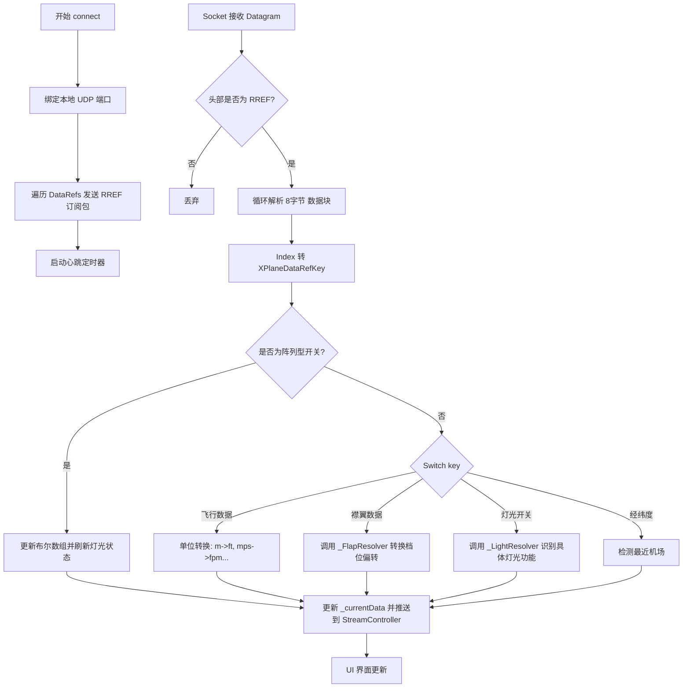

# X-Plane 数据监听与处理流程分析

本文档详细说明了 `XPlaneService` 如何通过 UDP 协议与 X-Plane 模拟器进行实时数据交换、解析及分发的全流程。

## 1. 核心监听流程概览

`XPlaneService` 的数据处理是一个典型的 "订阅-接收-解析-分发" 模型。

### 1.1 建立连接与订阅 (Subscription)
1. **端口绑定**：服务启动时，通过 `RawDatagramSocket.bind` 监听本地 UDP 端口（默认 19190）。
2. **批量订阅**：调用 `_subscribeToDataRefs()`。
    - 遍历 `XPlaneDataRefs.getAllDataRefs()` 中的所有配置。
    - 对每个 DataRef 发送 `RREF` 指令给 X-Plane。
    - **关键逻辑**：订阅时使用 `XPlaneDataRefKey` 枚举的 **索引 (index)** 作为 DataRef 的唯一标识符。这意味着 X-Plane 返回数据时，会带上这个索引。
3. **心跳维持**：`_startHeartbeat()` 每秒发送一次空速订阅请求，确保 X-Plane 知道客户端仍然在线并需要持续推送数据。

### 1.2 数据接收与预处理 (Reception)
1. **监听 Socket**：`_socket.listen` 持续捕获 UDP 数据包。
2. **解析头部**：`_handleIncomingData` 检查数据包前 4 字节是否为 `'RREF'`。
3. **解包数据**：
    - X-Plane 的 `RREF` 响应包中，每 8 字节代表一个数据点。
    - 前 4 字节为订阅时指定的 **Index** (Int32)。
    - 后 4 字节为 **Value** (Float32)。
4. **索引映射**：通过 `XPlaneDataRefKey.values[index]` 将数字索引还原为可读的枚举键。

### 1.3 数据转换与状态更新 (Processing)
1. **分发处理**：调用 `_updateDataByRefKey(key, value)`。
2. **阵列解析**：
    - 首先通过 `_updateSwitchArray` 检查是否属于 `landingLight` 或 `genericLight` 开关阵列。
    - 如果是，则根据相对偏移量更新对应的 `List<bool>`。
3. **字段转换**：对于非阵列数据，进入 `switch` 分支进行特定转换：
    - **单位转换**：例如米转英尺、米/秒转节/分钟。
    - **逻辑判断**：例如大于 0.5 判定为 `true`。
4. **联动逻辑**：
    - 更新灯光状态：调用 `_updateLightStatus()`。
    - 襟翼逻辑解析：调用 `_setFlapsState()`。
    - 机型自动识别：调用 `_detectAircraftType()`。

### 1.4 数据分发 (Distribution)
1. **状态拷贝**：使用 `copyWith` 创建 `SimulatorData` 的新副本，确保状态的不可变性。
2. **流推送**：调用 `_notifyData` 将更新后的数据推送到 `_dataController` 的广播流中，供 UI 或其他组件消费。

---

## 2. 数据流流程图 (Mermaid)

## 3. 关键组件说明

| 组件 | 职责 |
| :--- | :--- |
| `XPlaneDataRefKey` | 定义了 X-Plane 中所有关注的变量 ID。使用枚举以保证索引的顺序稳定性。 |
| `DataConverters` | 负责处理 UDP 字节流与 Dart 类型 (Int/Float) 之间的转换。 |
| `_updateSwitchArray` | **优化点**：通过数学计算直接定位阵列索引，避免了繁琐的 case 判断。 |
| `_LightResolver` | 跨机型逻辑层。将 X-Plane 裸的通用开关映射为具体的 "机翼灯"、"滑行灯" 等业务术语。 |
| `AircraftDetector` | 观察某些 DataRef 的变化规律（如档位数、发动机数）来猜测当前飞行的机型。 |
